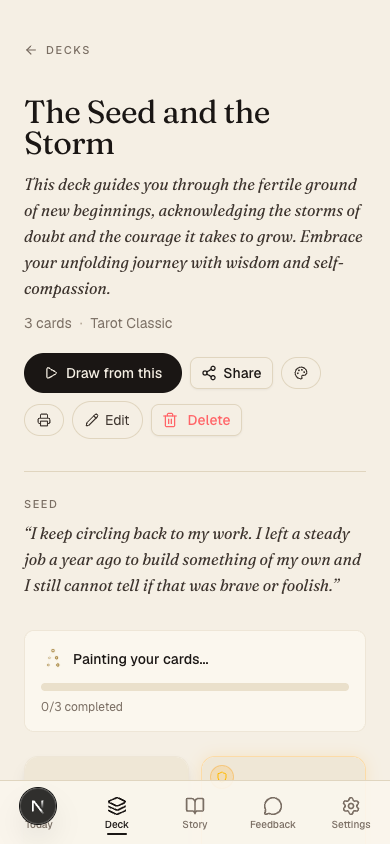
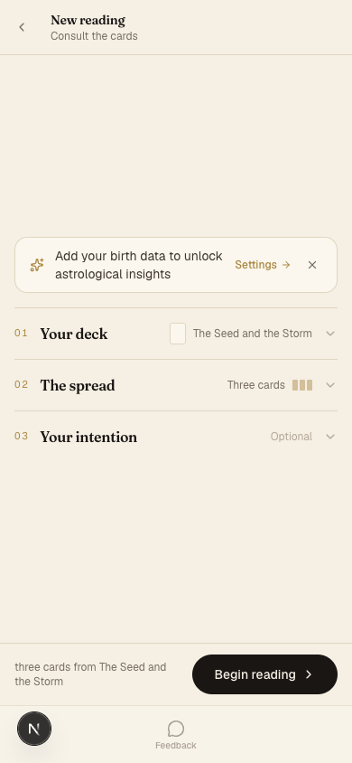
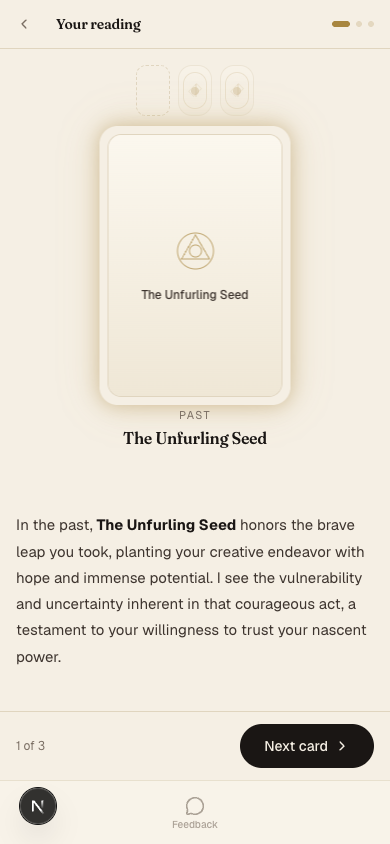
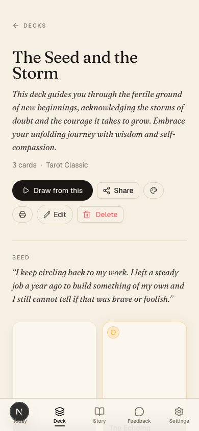
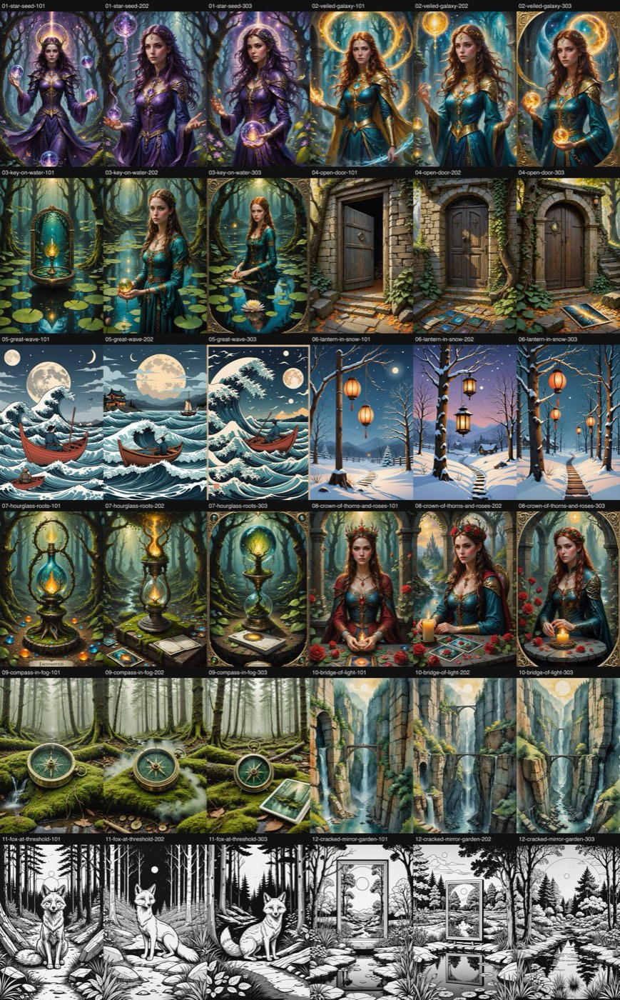
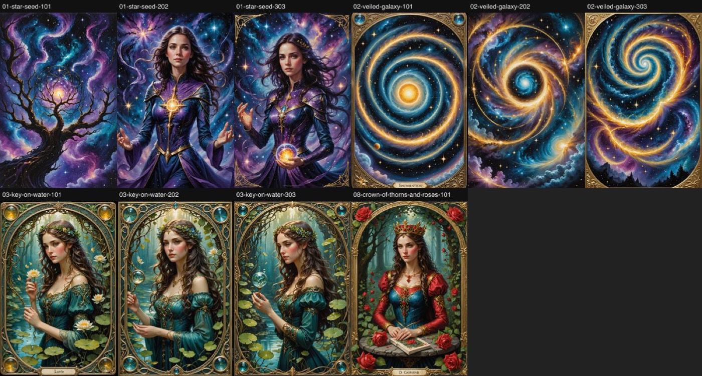
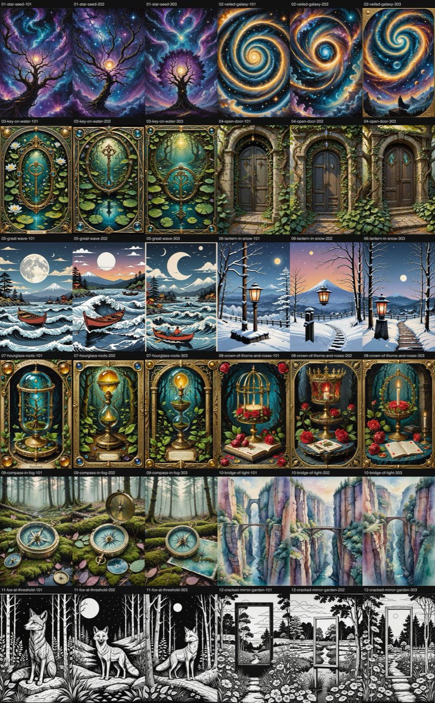
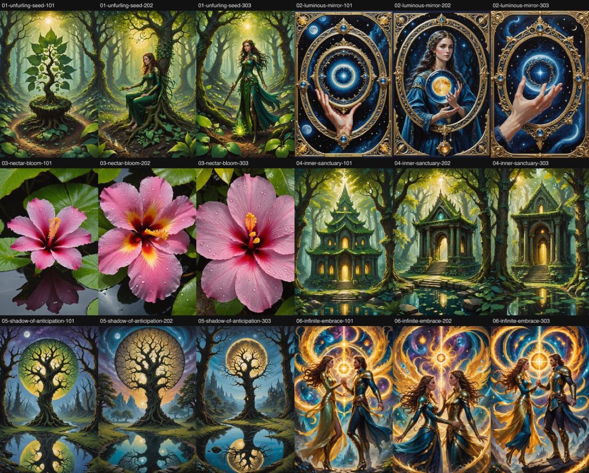
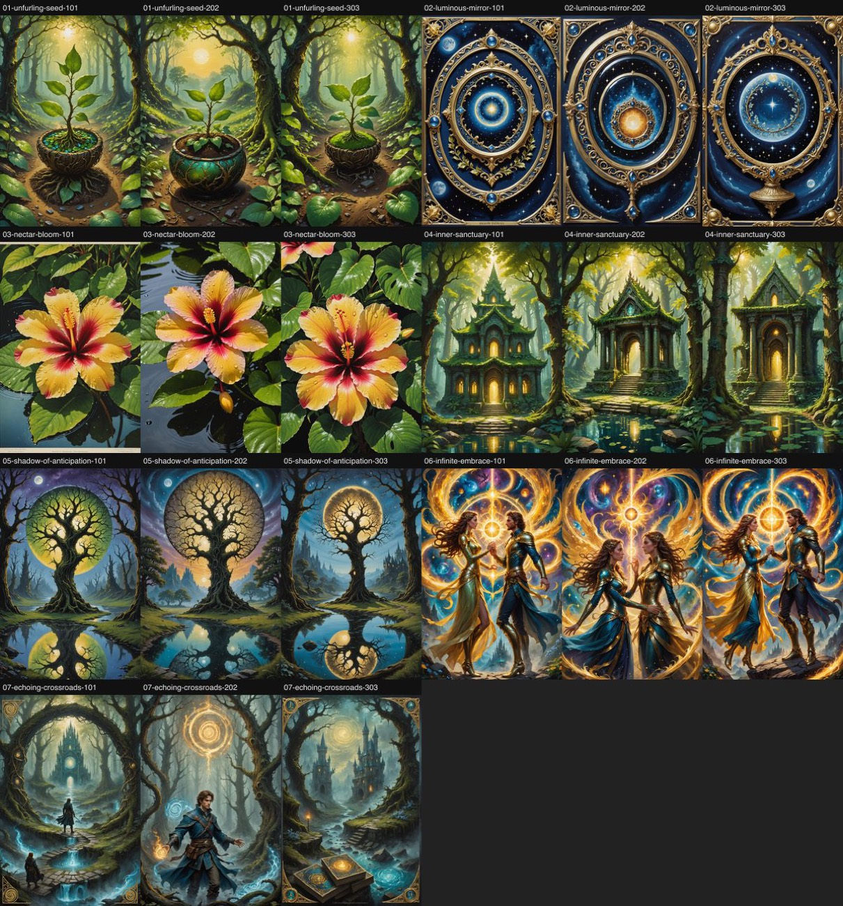
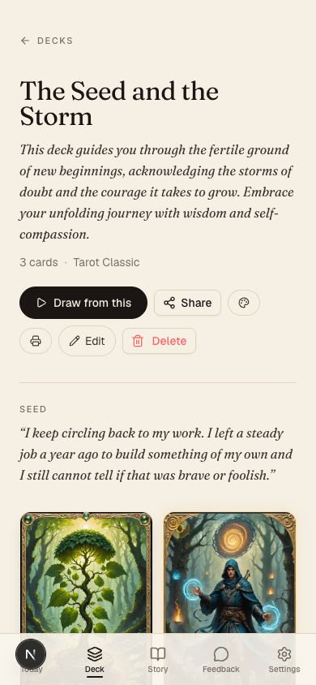

# MysTech — full read, September 2026

Nobody had looked at this app since 2026-08-13. This is what a stranger would have found on
2026-09-16, what was done about it that day, and what is still open.

Everything below is measured. Screenshots are in `docs/audit/2026-09/`; the art contact
sheets are the evidence for §2 and can be regenerated with `scripts/art-harness.ts`.

---

## 1. The first-time visitor walk

Driven headless at 390×844 against a genuinely new account
(`POST /api/auth/test-login` with a fresh `@example.com` address — the default test user
owns fifteen decks and a Pro subscription and cannot show you a first screen).

### Landing

Three sample cards fan behind a gold headline: *"Your life story, revealed in cards."* It
reads well and it loads clean — 19 requests, 309 KB of JavaScript, no console errors. The
subhead is generic SaaS (*"Transform your experiences into a personalized oracle deck"*) but
the promise is legible in two seconds, which is the job.

One thing a stranger cannot know: **all three sample cards show a robed woman.** They are
the only art on the page, and they are the exact failure mode the real generator has. The
landing is accidentally honest.

### Sign in

Google OAuth only. "Welcome back. Sign in to continue your practice." — shown to someone who
has never been here. Minor, and a real sign-up flow would cost more than it returns at eight
users.

### First day

Good. `/today` greets you by name, says *"Your first reading is a conversation with
yourself. Let's begin."*, and offers one card: **Begin your daily practice**. Nothing is
empty, nothing is broken, there is exactly one thing to do.

The prior survey expected an empty first day because the Daily Card cron skips users with no
deck. That is true of the *email*, not of the app. The screen is fine.

### The conversation, and the deck

Lyra asks one question at a time. You answer in a textarea. Then:

| Elapsed | Screen |
|---|---|
| 0s | "Shape my deck" clicked |
| 10s | *Naming what wants to be named…* |
| 30s | *Weaving the symbols…* |
| **40–50s** | **The deck exists** — title, description, style |

Forty to fifty seconds with two changing status lines. That is a long wait handled about as
well as a long wait can be.

Then the deck page:

> **Painting your cards… 0/3 completed**

It never moved. It would still say 0/3 tomorrow. Two separate faults sat underneath it:

1. **The Stability AI balance is zero.** Every card generation returns
   `402 payment_required`. There is no fallback image. *(Topped up by Ben the same day.)*
2. **Nothing ever retried.** Image generation is kicked off by a fire-and-forget `fetch`
   from the tab that created the deck. If that tab closes, crashes, or drops its connection,
   no other code path ever looks again. *(Fixed — the deck page now kicks the batch route
   once per load when every card is pending and none is in flight.)*

The deck description also read: *"Embrace your unfolding **journey** with wisdom and
self-compassion."* — the one word this app is not allowed to say, on the first deck a new
user is ever shown. *(Fixed at the prompt level.)*

### The reading

Setup is three closed rows and a CTA, all above the fold at 390px. This is good, and it
confirms CRM #65.

The interpretation is genuinely good — specific to what was said in the conversation, not
horoscope filler. But the card is a placeholder glyph, because there was no art. **The
product's central artefact was a grey rectangle.**

One dead end also existed here: a guided reading could sit on *"Let us begin…"* forever. The
auto-start flag was set before the 1.5-second timer rather than inside it, so if the effect's
cleanup cleared the timer — StrictMode's double invoke, or any re-render in that window — the
re-run saw "already started" and never dispatched. *(Fixed.)*

### After

The landing is unchanged to look at and 28 KB lighter. The deck page no longer lies: with the
art genuinely failing, it now reaches a failed state with a per-card **Retry** instead of a
progress bar that never moves.

**Verdict.** The walk has no dead ends, and — after the top-up the same day — it ends on a
deck with real, on-subject art. See §2.

---

## 2. Art quality

`scripts/art-harness.ts` — 12 fixed subjects, 3 fixed seeds each, 36 images, same styles the
app uses. This is the only sanctioned way to judge a card-art prompt change; every prior
attempt was tuned from one unseeded image and contradicted by the next draw.

### Baseline

**14 of 36 images contain a human figure that the prompt did not ask for.**

| Subject | Figures | What came back |
|---|---|---|
| star-seed | 3/3 | A robed sorceress in a forest. Not even a nebula. |
| veiled-galaxy | 3/3 | A woman in teal and gold with a halo ring. |
| key-on-water | 2/3 | Two women at the water; one correct still life with the wrong object. |
| great-wave | 3/3 | Wave and boat — with a rower, where the prompt said *empty* boat. |
| crown-of-thorns-and-roses | 3/3 | A crowned woman, every time. |
| open-door · lantern-in-snow · hourglass-roots · compass-in-fog · bridge-of-light · fox-at-threshold · cracked-mirror-garden | 0/3 each | Correct, uninhabited, on-subject. |

The negative prompt already lists *person, human, face, woman, silhouette of a person*. It
does not work. On Stability Core a strong positive prior beats the negative list.

**The failure tracks how concrete the subject is, not the style.** A door, a lantern, a
compass, a fox, a bridge and a mirror all render correctly — in the same art styles that turn
"a glowing seed suspended in a violet nebula" into a sorceress. When the model cannot picture
the subject, it falls back to what it thinks an *oracle card* is: a robed woman.

### v1 — subject first, framing last

Diffusion models weight early tokens. Today the card's own subject sits *behind* "Symbolic
illustration for an oracle card" and *in front of* a long style prompt, so the framing and
the style win. v1 puts the subject first.

Run on the four worst subjects before the Stability balance hit zero mid-run:

| | baseline | v1 |
|---|---|---|
| Images with a figure (of 10) | 9 | **6** |
| veiled-galaxy | 0/3 correct | **3/3 correct** |
| star-seed | 0/3 | 1/3 |
| key-on-water (Mucha) | 1/3 | 0/3 |
| crown-of-thorns (Rider-Waite) | 0/1 | 0/1 |

Real, partial, and **not shipped** — a change measured on ten images, that makes one style
better and one worse, is exactly what the "never tune from one sample" rule exists to stop.

### v2 — subject first, and the style's attractors stripped

The subjects v1 does not fix are precisely the ones whose *style* prompt names a figurative
canon: *"in the style of Alphonse Mucha"*, *"classical Rider-Waite inspired composition"*.
Mucha's entire body of work is women. v2 keeps v1's ordering and additionally strips
"oracle card", "tarot card" and "in the style of &lt;artist&gt;" from the style prompt,
leaving the palette, the ornament and the medium — which is what a style is actually for.

Run in full on 2026-09-16, same 12 subjects, same 3 seeds:

**2 of 36.** Down from 14.

| Subject | baseline | v2 |
|---|---|---|
| star-seed | 3/3 | **0/3** |
| veiled-galaxy | 3/3 | **1/3** |
| key-on-water (Mucha) | 2/3 | **0/3** |
| great-wave (Hokusai) | 3/3 | **1/3** |
| crown-of-thorns (Rider-Waite) | 3/3 | **0/3** |
| the other seven subjects | 0/3 each | 0/3 each |

Both figurative canons broke. The art-nouveau key is now an ornate key over lily pads in a
Mucha-shaped frame with no woman anywhere in it; the tarot crown is a crown on a plinth with
a candle, which is exactly what the card asked for. Nothing that was already correct got
worse, and no style lost its identity — the ukiyo-e is still ukiyo-e, the tarot is still
gilded.

The two remaining figures were checked by cropping the full-size images rather than reading
the contact sheet, and neither is the original failure mode: a distant caped silhouette on a
ridge under the galaxy, and two rowers in the boat of a Hokusai seascape — which is the
canonical composition, and arguably the prompt's fault for saying "empty rowing boat" to a
model that has only ever seen that boat crewed.

### The measurement was wrong, and a real deck said so

v2 went live, and the first real deck regenerated through it still came back with a robed
woman. **The twelve harness subjects were written by hand, so they were clean.** Real ones
are not: `deck-generation.ts` asks the LLM to state exclusions in the imagePrompt, so **17 of
the 91 cards in production end with a negation** —

> *"…Golden sunlight gently illuminates the scene from above, **without any human figures**."*
> *"…against a deep indigo cosmic backdrop. **No human figures are present.**"*
> *"…warm, golden, and serene. **NO LITERAL HUMAN FIGURES are present in the image.**"*

A diffusion model has no negation operator. That clause *names* the thing it means to forbid
— and v2 had just moved the card's own prompt to the front, where the weight is highest. v2
made this particular pathology worse while fixing everything else.

So the harness grew a `--set=real` mode: six prompts copied verbatim out of production, with
their real styles, including one control that legitimately asks for two figures.

| | v2 | v3 |
|---|---|---|
|  |  | |
| Unwanted figures (of 15) | **5** | **0** |
| unfurling-seed | 2/3 | 0/3 |
| luminous-mirror | 3/3 (two of them disembodied hands) | 0/3 |
| nectar-bloom · inner-sanctuary · shadow-of-anticipation | 0/3 each | 0/3 each |
| infinite-embrace *(control — wants figures)* | keeps them ✓ | keeps them ✓ |

v3 is v2 plus `stripSubjectNegations()`: the card's own "no human figures" clause comes out of
the positive prompt, where it was acting as a request, and the exclusion stays in the negative
prompt, where the model can act on it. The stripper is deliberately narrow — it matches only a
clause that is *both* a negation *and* about people — so the control card is untouched, which
the sheet confirms.

### What is still broken

One card from that same regenerated deck was not in the six, and still fails:

> *"A swirling vortex of faded parchment and ghostly blueprints, converging at a misty,
> indistinct crossroads…"*

**2 of 3 under v3.** There is no picturable object anywhere in that sentence, and this is the
baseline finding unchanged: when the model cannot picture the subject it falls back to what it
thinks an oracle card is. No amount of prompt ordering fixes it. The fix is upstream — the
deck-generation prompt should ask for a concrete, nameable object as the subject of every
card — and it is filed rather than guessed at, because its measurement loop is a different one
(read the prompts the LLM writes, not count the images the diffuser draws).

### Shipped

`buildCardImagePrompt()` in `src/lib/ai/prompts/image-base-prompt.ts` is now the single
assembly used by the card generator, the style-preview swatches, the seed script, the print
box and the card back. The harness's variants call that same function, so `--variant=v3`
measures the live code rather than a copy of it — five call sites each building their own
string is how this bug survived four attempts to fix it.

A separate defect surfaced while checking this and is also fixed: **regenerating a card
overwrote the same blob path**, so its URL never changed and every browser and CDN edge went
on serving the old picture. Retry and refine both looked like no-ops — the bytes in storage
were new, the screen was the old image. The stored URL now carries the write time.

The walk deck, regenerated end to end through the shipped path. Two of the three cards are
right. The third is the crossroads card above.

---

## 3. Pipeline health

**The nightly digest was dead: 89 of 93 markdown digests were `(NO DATA)` stubs.** The cause
was two faults on our side, both now fixed.

1. **The two stages never agreed on a filename.** Vercel cron stamps its JSON with the
   **UTC** date. The agent asked for `TZ=Asia/Makassar date +%F`, which at 03:22 WITA is
   already tomorrow. The names could not match on any night.
2. **The agent ran before its own input.** Hobby-tier cron is best-effort *within the hour*:
   scheduled 19:15 UTC, it has been landing at ~20:11. The agent fired at 19:22 — 49 minutes
   early, every night, and dutifully wrote a stub explaining that the data was missing.

Fixed by taking the newest `digests/*.json` on disk and naming the markdown after *it*, and
by moving the claude.ai trigger to 21:00 UTC (05:00 WITA).

Two further things were wrong with what the digest said:

- **It only ever carried counts.** "22 unreviewed feedback, 13 stuck readings" every night,
  unchanged, for months — a number nobody can act on. The JSON now carries the rows.
- **Stuck readings were counted since the beginning of time.** Of the 13, one was six hours
  old and the rest were between 33 and 134 days — abandoned tabs, not incidents. Windowed to
  7 days.

Still broken, and not ours to fix: `pipelineIngest: Vercel API 403 invalidToken`. The
`VERCEL_TOKEN` in the project env is dead, so deployment-event ingest has been failing since
at least 2026-08-08. Filed for Ben.

### Feedback triage

All **22** `new` rows were read and dispositioned (6 actioned, 9 dismissed, 22 reviewed
across the whole table; zero left in `new`). What they were:

- Six described behaviour that has since been rebuilt — the reading flow, the collapsed
  setup, the astrology pop-down. Closed against the commits that did it.
- Four were about routes that no longer exist (`/home`, `/studio/cards`) after the June IA
  overhaul. Dismissed.
- Five are downstream of the two dead credentials — card art (Stability) and read-aloud
  (Google TTS billing). Left `reviewed`, to re-test once the accounts are live.
- Three were test submissions. Two are product ideas kept for the roadmap.

---

## 4. Codebase health

| | Before | After |
|---|---|---|
| Dependencies | 45 | **34** |
| Phantom deps (imported, undeclared) | `three`, `@react-three/fiber` | **none** |
| Dead deps (zero import sites) | 5 | **0** |
| Animation libraries | 3 (framer-motion, gsap, react-spring) | **1** |
| Prototype playground in the prod bundle | 90 files | **gone** |
| Redirect-only `page.tsx` shims | 12 | **0** (config redirects) |
| Stale branches | 2 local, 4 remote | **0** (one tagged before deletion) |
| Vitest | 12 failures | **391 pass, 40 files** |
| `tsc --noEmit` | 12 errors | **clean** |
| Landing JS, production | 337 KB | **309 KB** |
| Untracked PNGs at the repo root | 199 | **0** |
| Lines deleted | — | **21,520** |

**The mock playground.** `src/app/mock` was four reading prototypes, a card-morph explorer
with ten stages and eight techniques, and a tower of "floors" — shipping inside the
production bundle. Deleting it orphaned three whole component trees nothing else imported
(`lab`, `mock`, `transitions`), and those in turn were the only consumers of the entire
three.js stack. That is where the phantom-dependency problem went: `three` and
`@react-three/fiber` were never declared because they arrived transitively through
`@react-three/drei`; with the lab gone, nothing imports them, so there is nothing to declare.

`gsap` had exactly one caller left — the landing hero's word reveal, eighty lines that
framer-motion (already on that page) does natively. Rewritten; that is the 28 KB.

**Still red, deliberately.** `npm run lint` reports 28 errors across ~40 files. Every one is
a React Compiler rule — *"Calling setState synchronously within an effect can trigger
cascading renders"*, *"Cannot access refs during render"*. They are real smells and none is a
live bug; fixing them is a refactor of most of the interactive components and was out of
scope for a session whose job was the visitor walk.

**Input validation.** 22 of 108 API routes import Zod. **51 of the 71 mutating routes
validate nothing.** Most read a body and trust it. This is the largest untouched risk in the
repo and it did not change today; it is not visible to a visitor, which is why it lost to
everything above.

**Caching.** There is none, anywhere. Every page is `ƒ` (server-rendered on demand). At eight
users that is correct.

---

## 5. What was done, in order

Ranked by effect on what a visitor sees or what Ben has to babysit.

| # | Change | Effect on the walk |
|---|---|---|
| 1 | Deck art self-heals; TTS stops retrying a dead endpoint; guided reading can't hang on "Let us begin…" | Three dead ends removed |
| 2 | House-voice rule in every reader-facing prompt | The first deck a user sees stops saying "journey" |
| 3 | Nightly digest reads the right file, at the right time, and carries rows | Ben gets a digest that says something |
| 4 | Feedback module to standard — honeypot, 5/h, domain snapshot, anon IP cap | The next report is answerable without guessing |
| 5 | Mock playground, dead deps, redirect shims, stale branches deleted | Nothing visible; the repo stops lying |
| 6 | Tests green, docs true | Nothing visible; the next session doesn't start from fiction |
| 7 | **Card art prompt — v3 shipped** | **Hand-written set 14 of 36 → 2 of 36; real prompts 5 of 15 → 0 of 15** |
| 8 | Regenerated cards get a new URL | Retry and refine stop looking like no-ops |

## 6. Still open

| What | Who | Where |
|---|---|---|
| ~~Stability AI balance is zero~~ | — | **Topped up 2026-09-16, 978 credits** |
| ~~`VERCEL_TOKEN` dead~~ | — | **Rotated across all four projects 2026-09-16** |
| Google Cloud TTS billing off — read-aloud 403s | **Ben** | CRM #174 |
| Abstract card prompts still draw a figure — fix at deck-generation time | Claude | CRM |
| 51 mutating API routes with no input validation | Claude | CRM |
| 28 React Compiler lint errors | Claude | CRM |
| No starter deck — the emailed Daily Card skips every user without one | Product decision | CRM |
| 12 planned features: person cards (12) and true deck collaboration (16) never built | Product decision | `docs/ROADMAP.md` |
